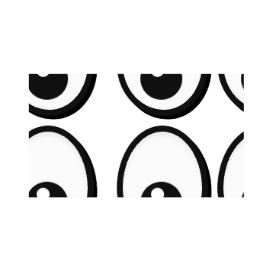

<p align="center">
  
</p>

<h1 align="center">I Can See You</h1>

Demo web app that simulates and visualizes browser-detectable distraction signals during a timed session. Experience what typical exam platforms can (and cannot) detect when you lose focus — tab switches, window blur, fullscreen exits, and more.

<p align="center">
  <a href="https://astro.build"></a>
  <a href="https://react.dev"></a>
  <a href="https://tailwindcss.com"></a>
  <a href="https://www.typescriptlang.org"></a>
  <a href="https://pnpm.io"></a>
  <a href="https://pages.cloudflare.com"></a>
</p>

> This project demonstrates **browser signals only**, not OS-level surveillance. Transparency is a core principle.

## Tech Stack

- **[Astro](https://astro.build)** 6.1 — static shell + routing
- **[React](https://react.dev)** 19 — interactive islands for session UI
- **[Tailwind CSS](https://tailwindcss.com)** 4.2 — utility-first styling
- **TypeScript** 6.0 strict mode
- **pnpm** 10.32 — package manager
- **Client-side state** — no backend for MVP
- **sessionStorage** — lightweight results transfer between `/demo` and `/results`
- **[@fontsource/nanum-pen-script](https://fontsource.org/fonts/nanum-pen-script)** + **[@fontsource/lxgw-wenkai-mono-tc](https://fontsource.org/fonts/lxgw-wenkai-mono-tc)** — typography
- **[Lucide React](https://lucide.dev)** — icons
- **[Cloudflare Pages](https://pages.cloudflare.com)** — deployment

## Getting Started

### Prerequisites

- Node.js >= 22.12.0
- pnpm (corepack recommended: `corepack enable`)

### Install

```sh
pnpm install
```

### Development

```sh
pnpm dev
```

Opens the dev server at `http://localhost:4321`.

### Type Check

```sh
pnpm check
```

### Production Build

```sh
pnpm build
pnpm preview
```

## Project Structure

```
src/
├── core/                   # Domain logic (detection, events, mascot, results)
│   ├── detectionEngine.ts
│   ├── eventStore.ts
│   ├── mascotController.ts
│   ├── permissions.ts
│   └── resultsBuilder.ts
├── components/
│   ├── demo/               # Session UI (active session, timer, incidents)
│   ├── landing/            # Hero, coverage section
│   ├── layout/             # Header, footer, shell
│   ├── mascot/             # MascotEyes component
│   ├── support/            # Fallback/error view
│   └── ui/                 # Shared primitives (Button, Card)
├── layouts/                # Astro layouts (Layout, DemoLayout)
├── pages/                  # Routes: /, /demo, /results, /signals
├── styles/                 # Global CSS, mascot styles
└── assets/                 # Static assets (SVGs)
```

## Routes

| Path       | Description                                      |
|------------|--------------------------------------------------|
| `/`        | Landing page with CTA and coverage overview       |
| `/demo`    | Timed detection session (60--90 s)                |
| `/results` | Summary dashboard with metrics and disclaimer     |
| `/signals` | Detection signal reference and coverage table     |

## Detection Signals

The app monitors these browser events during a session:

| Signal                | API / Event                         | Confidence |
|-----------------------|--------------------------------------|------------|
| Tab visibility change | `visibilitychange`                   | High       |
| Window focus / blur   | `window blur/focus`                  | High       |
| Fullscreen exit       | `fullscreenchange`                   | Medium     |
| Mouse leaves viewport | `mouseleave` on `document`           | Medium     |
| Paste behavior        | `paste` event                        | Low        |
| DevTools heuristic    | Window size discrepancy (best effort)| Low        |

Each incident is normalized into a `DetectionEvent` with `id`, `type`, timestamps, duration, `confidence`, and `source`.

## Design System

- **Visual identity:** Doodle / hand-drawn, monochrome palette, notebook-paper background
- **Mascot:** Expressive eyes with cursor-tracking pupils and blink animation
- **Typography:** Nanum Pen Script (display) + LXGW WenKai Mono TC (body)
- **Palette:** `#111` / `#444` / `#8A8A8A` / `#EAEAEA` / `#FAFAFA`

## CI

A GitHub Actions workflow runs type checks and build on every push and pull request targeting `main`. See `.github/workflows/ci.yml`.

## Contributing

1. Fork the repository
2. Create a feature branch (`git checkout -b feat/your-feature`)
3. Commit your changes (`git commit -m "feat: add your feature"`)
4. Push to the branch (`git push origin feat/your-feature`)
5. Open a Pull Request

Please follow the conventions described in `AGENTS.md` — preserve the approved MVP scope, keep the doodle monochrome visual identity, and prioritize user clarity and honesty.

## License

[MIT](./LICENSE) — 2025 Miguel Alvarez